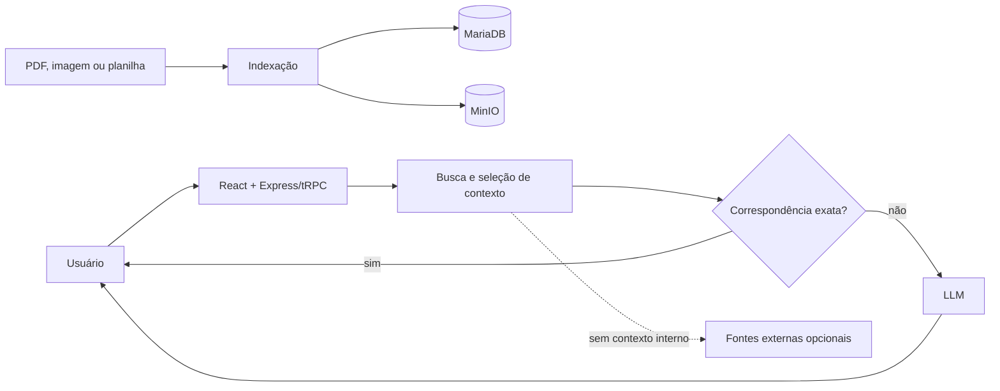

# LibertyAI

Chat privado para consultar uma base documental de saúde. A aplicação recebe PDFs e planilhas, reconstrói tabelas, indexa o conteúdo e responde com os trechos mais relevantes. Quando encontra uma linha e uma categoria exatas, devolve o valor diretamente; o modelo de linguagem é usado para perguntas que exigem interpretação.

Produção: [ia.libertysaude.com.br](https://ia.libertysaude.com.br/)

## Recursos

- autenticação individual, troca obrigatória de senha e administração de usuários;
- upload de PDF, XLSX, XLS e CSV pelo painel;
- ingestão automática de PDF, imagem, planilha e `fontes.txt` por pasta monitorada;
- extração textual de PDF, reconstrução de tabelas e leitura visual para páginas escaneadas;
- OCR de PNG, JPG e WEBP com Tesseract em português e inglês;
- reconhecimento de nomes parciais e equivalência entre códigos como `16` e `C16`;
- resposta direta para correspondências estruturadas únicas, sem aguardar o LLM;
- consulta externa apenas quando não há contexto interno relevante;
- fontes por documento e página e histórico isolado por usuário e navegador;
- botão **Reler arquivos**, que atualiza o índice sem remover o histórico;
- implantação com Docker Compose, MariaDB e MinIO.

## Tecnologias

React 19, Vite, TypeScript, Tailwind CSS, Express, tRPC, Drizzle ORM, MariaDB, MinIO/S3, OpenAI Chat Completions, `pdf-parse`, SheetJS, Tesseract e Vitest.

## Como funciona



Na indexação de PDF, o sistema tenta o texto nativo, reconstrói linhas e colunas numéricas e usa leitura visual somente em páginas escaneadas ou ainda ambíguas. Esse trabalho ocorre na indexação, evitando OCR e visão durante cada pergunta.

## Requisitos

Para desenvolvimento: Node.js 22, pnpm 10 via Corepack, MariaDB, armazenamento S3 compatível, chave do LLM e Tesseract para imagens. Em produção, o Docker Compose fornece Node, MariaDB, MinIO e Tesseract.

## Instalação local

```bash
corepack enable
pnpm install
cp env.example .env
pnpm db:push
pnpm dev
```

No PowerShell, use `Copy-Item env.example .env`. Preencha o `.env` antes de iniciar. A aplicação abre em `http://localhost:3000`. Sem `KNOWLEDGE_DIR`, o desenvolvimento usa `./knowledge`.

## Variáveis principais

| Variável | Uso |
| --- | --- |
| `PORT` | Porta Node; padrão `3000`. |
| `DATABASE_URL` | Conexão MariaDB. |
| `ADMIN_EMAIL`, `ADMIN_PASSWORD` | Credenciais iniciais do administrador. |
| `LOCAL_AUTH_SECRET` | Assinatura das sessões locais. |
| `S3_ENDPOINT`, `S3_REGION`, `S3_BUCKET` | Destino S3/MinIO. |
| `S3_ACCESS_KEY_ID`, `S3_SECRET_ACCESS_KEY` | Credenciais do armazenamento. |
| `LLM_BASE_URL`, `LLM_API_KEY`, `LLM_MODEL` | Provedor e modelo do chat. |
| `LLM_TIMEOUT_MS` | Timeout do LLM; padrão `45000`. |
| `LLM_MAX_COMPLETION_TOKENS` | Limite da resposta; padrão `600`. |
| `LLM_REASONING_EFFORT` | Esforço para GPT-5; padrão `minimal`. |
| `PDF_VISION_ENABLED` | Leitura visual seletiva; padrão `true`. |
| `PDF_VISION_MODEL` | Modelo visual; padrão `gpt-4.1-mini`. |
| `PDF_VISION_MAX_PAGES` | Páginas visuais por PDF; padrão `20`. |
| `TAVILY_API_KEY` | Consulta externa complementar; opcional. |
| `KNOWLEDGE_DIR` | Pasta monitorada. |

Use [env.example](env.example) como referência e nunca envie credenciais reais ao Git.

## Qualidade

```bash
pnpm test
pnpm check
pnpm build
```

## Implantação

Crie o `.env` e a pasta persistente da base:

```bash
sudo mkdir -p /data/liberty-ai/knowledge
sudo chmod 775 /data/liberty-ai/knowledge
docker compose up -d --build
docker compose ps
```

O Compose inicia aplicação, MariaDB e MinIO. As migrações rodam antes do servidor. No Coolify, use **Docker Compose**, associe o domínio à porta interna `3000` e não exponha MariaDB ou MinIO publicamente.

Para atualizar:

```bash
git pull
docker compose up -d --build
```

Depois de mudar o indexador, abra `/admin` e clique em **Reler arquivos**. Isso recria os trechos de PDFs e planilhas sem apagar conversas.

### Diagnóstico do tempo de resposta

Cada pergunta gera logs JSON com `event: "chat_timing"` e um `requestId`. No Coolify, filtre por `chat_timing`, escolha um identificador e compare `durationMs` entre `database_search`, `structured_match`, `external_search`, `llm` e persistência. Os logs registram tempos, contagens e memória, sem incluir a pergunta, o e-mail ou o conteúdo recuperado.

## Estrutura

```text
client/                 interface React
server/_core/           bootstrap, contexto e tRPC
server/routes/          contratos da API
server/controllers/     casos de uso
server/services/        indexação, busca, LLM, OCR e S3
server/repositories/    persistência Drizzle
drizzle/                schema e migrações
docs/                   arquitetura e operação
```

## Documentação

- [Documentação completa do projeto](docs/PROJETO.md)
- [Guia operacional](docs/guia-operacional-libertyai.md)
- [Ambiente da VPS](docs/vps-environment.md)
- [Política de fontes externas](docs/external-source-policy.md)

## Segurança

O chat exige conta ativa e não oferece cadastro público. Cookies são HTTP-only; a API valida usuário, navegador e conversa. Segredos ficam no servidor. Documentos são tratados como conteúdo, não como instruções. Use HTTPS válido e não versione `.env`, dumps ou arquivos privados.

## Licença

MIT, conforme o `package.json`.
